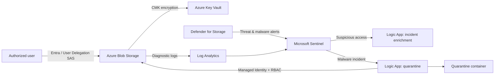
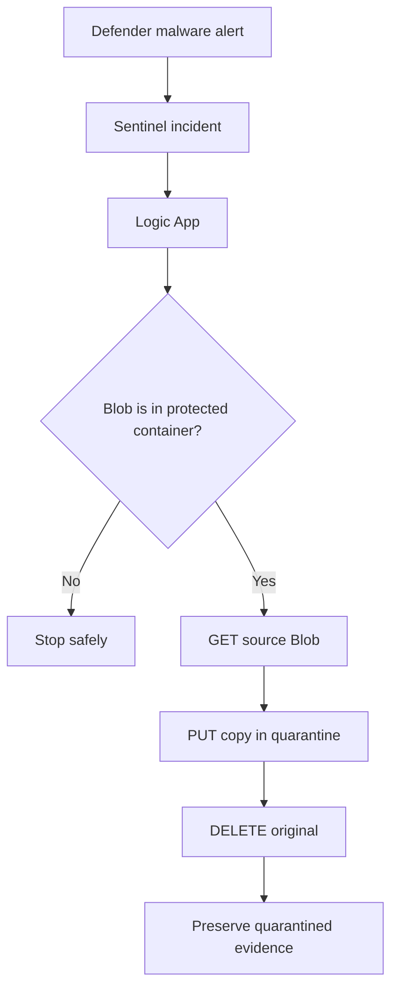

# Azure Secure File Storage & Incident Response Lab

Hands-on **Azure cloud security / SOC / IAM** project demonstrating how preventive controls, centralized telemetry, custom detection engineering, Microsoft Sentinel, Defender for Storage, and Logic Apps can be combined to protect sensitive Blob data and respond to security incidents.

> All activity was performed in an authorized Microsoft Azure student lab. Credentials, SAS tokens, public IP addresses, subscription identifiers, university identifiers, and other sensitive values have been removed or generalized.

## Project outcomes

This lab implemented a private Azure Blob Storage environment protected by Microsoft Entra authorization, Azure RBAC, restricted network access, TLS, and a customer-managed encryption key in Azure Key Vault. Storage telemetry was sent to Log Analytics and investigated with KQL. Microsoft Defender for Storage and Microsoft Sentinel supplied threat detection and incident management, while Logic Apps provided automated enrichment and malware containment.

Four controlled scenarios were validated:

| Scenario | Detection / control | Response |
|---|---|---|
| Unauthenticated Blob request | Azure access control + `StorageBlobLogs` / Sentinel | Request denied; Sentinel incident enriched by Logic App |
| Valid SAS used through Tor | Defender for Storage threat detection | Suspicious access surfaced for investigation |
| EICAR test-file upload | Defender for Storage malware detection | Managed-identity Logic App quarantined the Blob |
| User-delegation SAS reused from multiple IPs | Custom KQL + Sentinel analytic | High-severity incident; analyst-approved delegation-key revocation |

## Architecture



## Skills demonstrated

**Azure security & IAM:** Blob Storage security, Microsoft Entra authorization, Azure RBAC, managed identities, user-delegation SAS, least privilege, Key Vault, customer-managed keys, restricted network access.

**SOC & detection engineering:** Microsoft Sentinel, Log Analytics, `StorageBlobLogs`, KQL hunting and correlation, custom analytics, incident triage, detection tuning, false-positive analysis.

**Incident response & SOAR:** Logic Apps, Sentinel automation, incident enrichment, automated malware quarantine, containment guardrails, credential revocation, analyst-approved response decisions.

**Security engineering:** defense in depth, Zero Trust / assume-breach thinking, telemetry validation, safe automation, troubleshooting and control verification.

## Detection queries

Sanitized KQL used in the project is available in [`queries/`](queries/):

- [`failed-blob-access.kql`](queries/failed-blob-access.kql) — surfaces failed Blob operations for investigation.
- [`multi-ip-delegation-sas.kql`](queries/multi-ip-delegation-sas.kql) — correlates successful user-delegation SAS access to the same Blob from multiple source IPs.
- [`suspicious-sas-hunting.kql`](queries/suspicious-sas-hunting.kql) — hunts successful SAS-authenticated Blob reads.

## Incident-response workflows

The suspicious-access workflow enriches Sentinel incidents without automatically changing data when evidence is ambiguous. The malware workflow performs automated containment only after validating that the alert refers to the protected source container.



See [`docs/incident-response.md`](docs/incident-response.md) for the response design and [`docs/architecture.md`](docs/architecture.md) for the control model and production-hardening considerations.

## Engineering lessons

The lab showed that successful authorization does not necessarily mean trustworthy behavior. A stolen SAS can still produce HTTP 200 responses, so contextual and behavioral detection is required. Testing also exposed practical issues: browser caching changed expected response codes; Google Read-Aloud created misleading additional IP activity; incident grouping could interfere with automation; and Defender scanning a quarantined object could create a response feedback loop. The final malware workflow therefore checks the source URI before destructive actions.

The multi-IP SAS response was intentionally kept analyst-approved because legitimate mobile networks, proxies, or roaming can also produce multiple source addresses. After confirming the controlled compromise, user-delegation keys were revoked and the previously valid SAS was verified as unusable.

## Repository structure

```text
Azure-Secure-Storage-SOC-Lab/
├── README.md
├── docs/
│   ├── architecture.md
│   └── incident-response.md
├── queries/
│   ├── failed-blob-access.kql
│   ├── multi-ip-delegation-sas.kql
│   └── suspicious-sas-hunting.kql
├── SECURITY.md
├── .gitignore
└── LICENSE
```

## Production hardening

A production deployment should additionally consider Private Link/private endpoints, a Key Vault firewall, disabling Shared Key authorization, dedicated Entra security groups, Conditional Access, formal alert routing/on-call ownership, infrastructure as code, and continuous telemetry-health monitoring.

## Scope

This repository documents a controlled educational cloud-security lab. The detection examples are provided as portfolio evidence and should be tuned, tested, and reviewed before use in a production environment.
