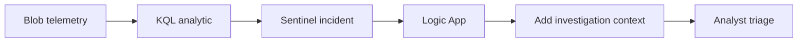
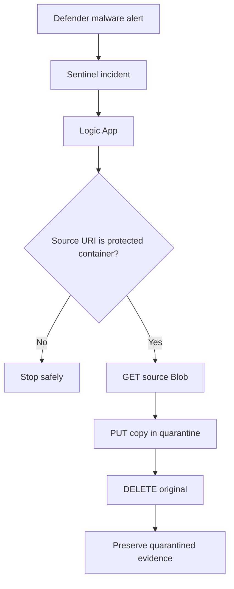

# Incident Response Design

## Suspicious access workflow

This workflow enriches an incident without automatically modifying data when the evidence is ambiguous.

## Malware containment workflow

The source-container check is a safety control. It prevents the playbook from responding recursively to a malware alert generated when Defender scans the quarantined copy.

## Compromised SAS response

The multi-IP SAS detection intentionally requires analyst validation before revocation. Network changes, proxies, roaming, and browser-side services can create benign multi-IP behavior. Once compromise is confirmed, revoking user-delegation keys invalidates affected user-delegation SAS credentials.
